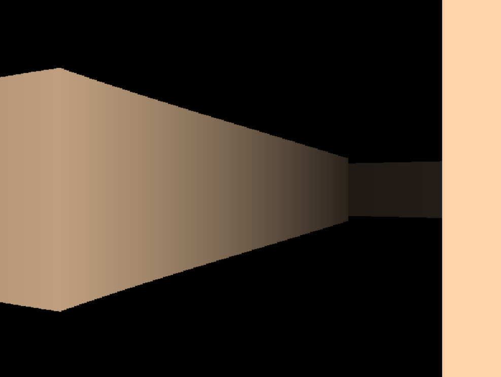

# Python Raycast

Это простая игра - 3D лабиринт, реализованная с использованием Python и технологии Raycast.



## Требования

Для запуска проекта необходим установелнный Python

Все зависимости для проекта указаны в файле `requirements.txt`. Вы можете установить их с помощью следующей команды:

```bash
pip install -r requirements.txt
```

## Запустите игру, выполнив команду:

```bash
python main.py
```

Игра начнется, и вы сможете перемещаться по лабиринту с помощью клавиатуры.